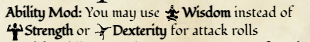

## ADD CAMPAIGN SWITCHER
- Add a way to categorize characters to their respective campaign and the ability for the player to have multiple characters, if they have 2, they will get a popup on login to select the character they want. The DM then needs to have the ability switch between campaigns and see the characters that are in that campaign. This will be a major slice, but it will be a good way to organize the characters and campaigns, also the ability to create multiple characters (seed multiple characters) for 1 account. NEEDS A DESIGN
- Worth designing it as "a campaign has settings", so you can edit the theming too.

## BETTER IMAGE UPLOADS
- Like so you don't have to use the sql for it. (probably on each character portrait or thing that has an image, you get an input for image files)

## NOT DONE:
- Nested target conditions `(tag:"fire" & roll:"damage.melee") | tag:"epic_spell"` — the `or`/`and` toggle shipped; the NESTED form is designed, costed and deferred in `GUIDE_Codex_Deferred.md` with a named trigger (two workaround effects both matching at once, so the contribution lands twice). Not open work — waiting on its trigger.

## ISSUES
- Add a way to add a picture of shopkeeper to the menu (needs design (both shopkeeper editor & the actual menu) + better image uploads)
- We would replace the effect picker in the spell editor when the spell can target allies with the updated form, where you only get a searchbar and a list to pick, because you set if the effect is a buff or debuff in the effect editor, we still need to cover heal though.
- Spells that grant effects don’t currently do anything except give an indicator to the effects panel, update the effect granter when effect editor is built. — **OPEN, and unscoped.** The effect editor exists; what "integration" means does not: which effects a spell may grant, whether casting applies them, and how they expire. Needs reading before building.
- §19's `AmmoBonus` deletion is still owed: nocked ammunition adds a flat, named bonus through its own path rather than being a graph contributor like everything else. Blocked on "what does active mean for a carried item" in `GUIDE_Codex_Deferred.md` — a nocked stack is *carried*, not equipped.
  ~~- The class thing in the lore screen is off center with the class name~~
  ~~- Background editor missing?~~
  ~~- Enforce Feat prerequisites~~
  ~~- Add a "needs to be held in both hands" toggle to weapons, so you can't dual-wield claymores, when this is toggled, and you equip the weapon to main (you can't equip it to secondary), and then the secondary slot gets locked.~~
  ~~- Languages can't be set.~~
  ~~- Missing a block in the weapon wiki on the roll context panel~~
  ~~- When you cast a spell it doesn't add a notification to the roll context panel, and it doesn't have a "go to context panel"~~
  ~~- Fire damage on spellbook is orange and on roll context panel it's red, make it consistent~~
  ~~- Weight from the import is not correct probably, most items have no value too.~~
  ~~- Weapons should be tagged "martial" or "simple", not just "weapon".~~
  ~~- The players should be able to level up themselves, but the DM should be able to level up the players too. (DM view) [Leveling up is a part of the game that most are very excited for, so when a DM does it all for you, you don't get the same feeling as you would if you did it yourself.]~~
- Icons in text (like markdown), see image: 
- Roll initiative, (only the D20 + whatever number, this will also synergize with the Persistent rage feature.)
- Notes (feature editor) don't resolve markdown in the roll context panel.
- Feature editor should have Reset on turn in the reset picker (short and long rest) so you don't have to make variables to reset on advancing turn.
- The filters on the feature panel should be on the same line as the usable & passive filters, so it doesn't take up valuable space on the laptops and to fill the empty space on the right of them.
~~- Improved Brutal Strike Enhanced doesn't work?~~ It does
- Wouldn't the current implementation of the brutal strike grant the bonuses even if the improved feature wasn't present?
- Relentless Rage should roll the DC check then offer to restore the hp?
- Labels are strange with {}, like I want to express that on level 17 it is 2d10, but if I do {level >= 17 ? 2d10 : 1d10} it kinda resolves on the feature screen, like it displays 1d10 - Add 2d10 to your damage roll, but on other screens it remains the non-computed format.

## GRAND UNIFICATION
- A centralized editor for everything (except shards). Effects, features, spells, items, shopkeepers, loot tables. Exactly like in Dicecloud, where you first set what each node is supposed to be and then edit from there, like you set an item node, and you get stuff regarding items in the editor. Exactly like in Dicecloud (last, post launch, just QOL)

## GAPS WHILE PORTING ARBITER
- Magical Bonus: +1 to attack and damage rolls, increases with Path features, which put the bonus to +2 on 10 points, and ect. Possible now?

## LEFT TO DO:
SMALL CHANGES TO DESIGN:
- Spellbook (designed, needs a category for spells from features though ("use sanctuary on will" → no need for spellslot (cantrip), should be like a category or some indicator that you got it from a feature)

NO DESIGN / ONLY PART OF DESIGN:
- Mobile port (only inventory designed)
- Campaign switcher / character switcher (needs design) (last thing to implement)
